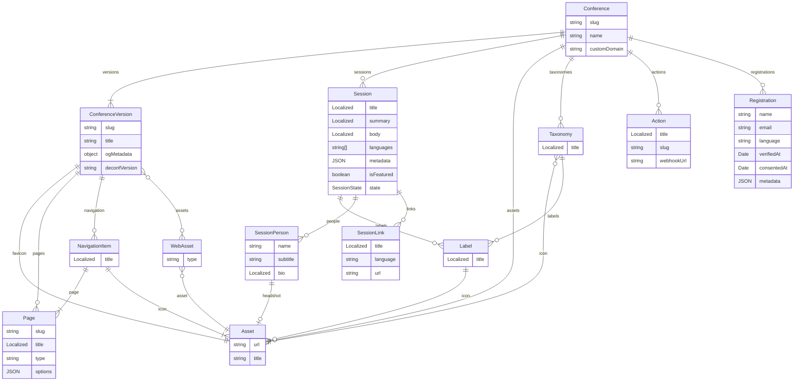

# deconf-next

Where should deconf go next?

## Key features

These things are important features that should not be lost

- Localisation
- Scalable architecture
- Easy integration
- Lightweight client
- Quickly getting into sessions

## Goals

- "developer-less" or "developer-lite"
- Highly customisable
- Plug-ability or extension-based
- Less client-side JavaScript / more static content

## IDEA: A CMS approach

There could be a central admin service to configure and deploy instances, manage the schedule and content through a namespaced/multi-tenant API. Maybe something to take a configured version of a conference, apply cusomisations and built it into static HTML/CSS/JavaScript and host it on a CDN.

**feature exploration**

- Configure instances
  - Setup pages & their navigation entries
  - Customise or override i18n strings
  - Set the theme, e.g. css variables or static assets
  - Input custom CSS / JS (or link to them?)
  - Add Custom <head> tags too
  - Custom OpenGraph tags and images
- Generate a website
  - Take above theming and generate static assets
  - Deploy assets on a CDN
  - Configure a gateway to do DNS / reverse-proxy
  - Promote specific versions to production or rollback to older versions
- Manage content
  - Edit sessions/speakers and taxonomies to categorise them
  - Setup a user allow list
  - Upload files and media to be hosted on the CDN
- Namespaced deconf API
  - A version of deconf-api-toolkit that is namespaced per conference
  - User authentication per conference too
- Gateway server
  - A service to handle requests for assets and request from the right bucket
  - Handle the "active" deployment and return their specific assets
  - Handle CNAMEs and request Let's Encrypt certs

## IDEA: Generic deconf client

There could be a generic deconf client that you plumb in a configuration and it does the whole front-end via JavaScript

- a pre-generated JSON config "window.DECONF = { ... }" -type thing
  - The pages of the site
  - Site navigation
- rework to be more of a multi-page-app rather than SPA
- Generated css e.g. ":root { --deconf-primary: rgba(1,2,3); }"

## IDEA: Extensions

Provide extension points for specific conferences to provide their own logic, either by specifying a custom URL to request information or an admin API to push in the information. Custom micro-services could them be written to provide bespoke logic outside the platform.

**registrations**

- allow the registrations to be pulled in from a 3rd party source
- i.e. ti.to / notion
- it would turn off the "registration" endpoints and UI

**schedule**

- allow sessions/speakers/taxonomies to be pulled in from a 3rd party service
- i.e. pretalx / notion
- it would disable the schedule tab or make it read-only for admins

**content**

- pull in content from a 3rd party like a GitHub repo
- Need to think about how this would work with the pages CMS
- Maybe leave out of the MVP for now

**admin actions**

- Add custom admin actions for the ?dev menu
- An id, title and URL and the client can ask the server to perform the task and await a http/200

**verification**

- Validate a registration and/or it's userData field
- This could implement the allow-list logic for MVP

There could be some nice containers alongside to provide common extensions like an allowlist of emails or scraping from pretalx

## IDEA: new data structures

> Copy and paste here to view online: https://mermaid.live/edit



**notes**

- Some `Asset` links could just be hardcoded from locations in the S3 bucket, e.g. `:conference_slug/static/favicon.png`. This could reduce unnecessary relationships.
- New features could be build using "metadata" json fields then implemented for production with actual database fields
- Keeping all the conference versions in the database might be over-the-top
- Pages are more like "modules" in they could be multiple pages on the front end
- Page (or "modules") + Navigation item could be merged to simplify things?
- WebAsset might not be needed, but if there is going to be a join table it might be useful?

## IDEA: namespaced API

namespacing options:

- custom header — X-DECONF-INSTANCE: dog-con-21
- subdomain — https://dogcon-21.deconf.app
- subpath — https://api.deconf.app/dogcon-21/…

> Should the API be versioned too?

```
GET /
GET /attendance/:session
POST /attendance/:session/attend
POST /attendance/:session/unattend

GET /calendar/ical/:session
GET /calendar/google/:session
GET /calendar/me
GET /calendar/me/:token

GET /schedule
GET /schedule/:session/links

GET /auth/me
POST /auth/login
GET /auth/login/:token
DEL /auth/me
```
